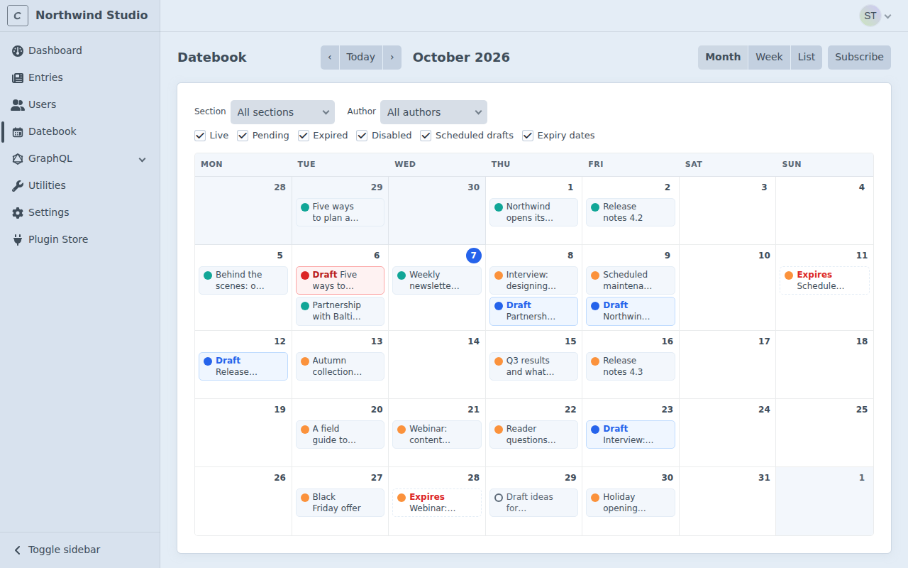
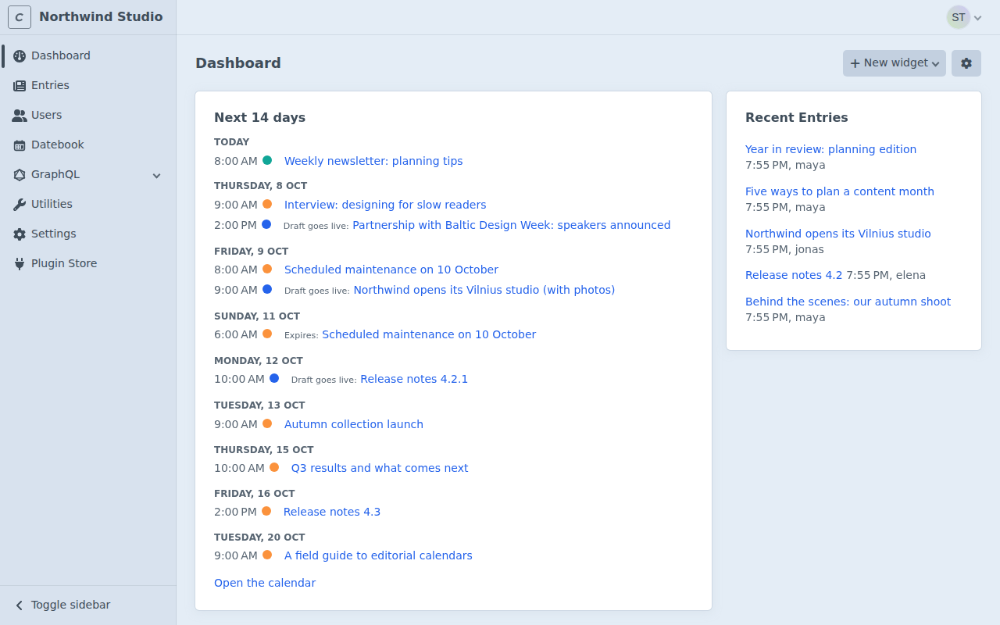

<p align="center"></p>

# Datebook

A content calendar for Craft CMS 5. See when entries go live, when they expire and when drafts will be published, all on one calendar. Drag an item to another day to reschedule it. Schedule a draft of a live entry and Datebook publishes it on time.



## Features

- **Month, week and list views** of entries by post date and expiry date, and of scheduled drafts.
- **Drag and drop rescheduling.** The time of day stays the same. Set an exact date and time from the details popup.
- **Filters** by site, section, author and status.
- **Scheduled drafts.** Make changes to a live entry in a draft and pick when they go live.
- **Safe publishing.** Drafts are checked in every site before they go live, and only by people who may publish them. If something is wrong, the draft stays a draft and the calendar shows the reason.
- **Dashboard widget** with what goes live, expires or gets published in the next 14 days.
- **Private calendar feed** for Google Calendar, Outlook and Apple Calendar.
- **Email notices** when a scheduled draft is published or cannot be published.
- **Permissions** for rescheduling, scheduling drafts and calendar feeds.

## Requirements

- Craft CMS 5.5.0 or later
- PHP 8.2 or later
- MySQL or PostgreSQL

## Installation

From the Plugin Store: in the control panel, go to **Plugin Store**, search for "Datebook" and press **Install**.

With Composer:

```bash
composer require zemis/datebook
php craft plugin/install datebook
```

## Getting started

1. Open **Datebook** in the control panel sidebar.
2. Give your editors the permissions they need (see [Permissions](#permissions)).
3. For drafts that go live at the exact minute, add the [cron job](#publishing-on-time). On Craft Cloud you can skip this step.

## The calendar

### What you see

| Item | Shown on | Looks like |
| --- | --- | --- |
| Entry going live | its post date | a plain item |
| Entry expiring | its expiry date | "Expires" with a dashed border |
| Scheduled draft | the day it will be published | "Draft" in blue |
| Failed draft | the day it was due | "Draft" in red, with the reason |

The dot before each item shows the status: live, pending, expired, disabled, scheduled or failed. Click an item to open it. Click **…** on an item for its details.

Singles are not shown with post or expiry dates, but their scheduled drafts are.

### Views and filters

Switch between **Month**, **Week** and **List** in the top right. Use the arrows and **Today** to move through time.

Filter by **site** (on multi-site installs), **section**, **author** and **status**, and turn **expiry dates** on or off. The filters are part of the page address, so you can bookmark a view or share it with a colleague.

Weeks start on the day set in your account preferences. Dates and times are shown in the system time zone. On Craft 5.10 and later, they are shown in your own time zone if you picked one in your account preferences.

### Rescheduling

Drag an item to another day. Its time of day stays the same, even across a daylight saving change. To pick an exact date and time, click **…** on the item, change **Date and time** and press **Save**.

- Moving a post date moves the day the entry goes live. Moving an expiry date moves the day it expires. Moving a scheduled draft moves the day it will be published.
- The post date must stay before the expiry date.
- Moving the post date of a live entry to a later time hides the entry from your site until then. Datebook asks before it does that.
- Moving the post date of a pending entry to a time that has passed makes it live right away. Datebook asks first here too.
- Moving the expiry date of a live entry to a time that has passed hides it right away. Moving the expiry date of an expired entry to a later time makes it live again. Datebook asks first in both cases.
- These checks look at the date and the time, so a move within today is checked too.
- Each move saves a new revision of the entry with the note "Rescheduled on the Datebook calendar."

You can only move items you are allowed to save, in sites you are allowed to edit.

A view shows up to 1,500 entries for each kind of date. If there are more, a notice asks you to narrow the view with a filter.

## Scheduled drafts

Scheduled drafts let you prepare changes to a live entry and publish them later, for example a price change at midnight or an updated press release in the morning.

1. Open a live entry and create a draft, as you normally would in Craft.
2. Make your changes and save the draft.
3. In the sidebar, find **Publish this draft later**, pick a date and time and press **Schedule**.

At that time, Datebook applies the draft to the live entry, just like pressing **Apply draft**. The new revision is credited to the person who scheduled the draft.

If someone changed the live entry after the draft was made, those changes are kept. Datebook brings them into the draft first, the same way Craft does when you open the draft. Only what you changed in the draft replaces them.

You can schedule drafts in the sections that are on the calendar (see the **Sections** setting). If you take a section off the calendar later, its scheduled drafts are still published on time, and you can still unschedule them in the draft sidebar.

To change the time, edit it in the sidebar or drag the draft on the calendar. To cancel, press **Unschedule**.

Before a draft goes live, Datebook checks that:

- the draft is still scheduled for that time, so a draft you just moved or unscheduled stays a draft;
- the person who scheduled it still exists, is active and may still publish it;
- the live entry still exists;
- the draft is valid in every site, with the same rules Craft uses for live content.

If a check fails, nothing is published. The draft stays a draft, it is marked as failed on the calendar with the reason, and an email is sent if you turned that on. Fix the problem and schedule the draft again.

Only drafts of existing entries can be scheduled. For a brand new entry, set its post date instead.

### Publishing on time

Datebook publishes scheduled drafts with Craft's queue. While drafts are scheduled, a publish job runs at least every 15 minutes and at the minute a draft is due. Each job adds the next one, and Datebook makes sure these jobs do not pile up in the queue. Craft runs queue jobs while people use the control panel, so drafts can go live a little late on a quiet site.

For exact timing, run this command every minute with cron:

```bash
* * * * * php /path/to/your/project/craft datebook/drafts/publish
```

The command is safe to run as often as you like. A lock makes sure a draft is never published twice.

#### Craft Cloud

Craft Cloud runs queue jobs on its own, so you do not need cron there. Scheduled commands on Cloud run at most once an hour, so they are too slow for this anyway. Cloud's queue only accepts jobs that wait 15 minutes or less, and Datebook's jobs never wait longer than that.

### Console commands

| Command | What it does |
| --- | --- |
| `php craft datebook/drafts/publish` | Publishes every scheduled draft that is due. |
| `php craft datebook/drafts/list` | Lists all scheduled drafts with their time and status. |

## Dashboard widget

Go to **Dashboard**, press **New widget** and choose **Upcoming content**. It lists what goes live, expires or gets published, day by day. In the widget settings you can choose how many days to show (1 to 60, 14 by default) and whether to include expiry dates and scheduled drafts.



## Calendar feed

Press **Subscribe** on the calendar to get your private calendar link. Add it to your calendar app:

- **Google Calendar:** Other calendars, **+**, **From URL**.
- **Outlook:** Add calendar, **Subscribe from web**.
- **Apple Calendar:** File, **New Calendar Subscription**.

The feed shows the same items you see on the calendar, from 30 days back to 180 days ahead. Each item is a 15 minute event with a link back to the control panel. Times are written in UTC, so your calendar app shows them in your own time zone.

You can narrow the feed by adding parameters to the link:

- `?site=siteHandle` shows another site you may edit.
- `?sections=news,blog` shows only those sections.

Anyone with the link can see your feed. If you shared it by mistake, press **Reset link** and the old link stops working right away. The link also stops working when your account is suspended or loses the permission.

Calendar apps refresh subscribed calendars on their own schedule. Google Calendar can take several hours.

Feed links start with the address of your primary site. In headless mode they start with the address of the control panel instead, because the site address belongs to your front end. In two cases you need to set **Feed link address** in the plugin settings: when calendar apps cannot reach that address, and when the control panel has a domain of its own (`cpTrigger` set to `null`). Use an address where Craft answers front-end requests, for example the one your GraphQL API uses.

## Email notices

Datebook can email the person who scheduled a draft, and the person who created it:

- when a scheduled draft is published (off by default);
- when a scheduled draft cannot be published (on by default).

Turn them on or off in the plugin settings. Edit the texts in **Utilities**, **System Messages**.

## Settings

Go to **Settings**, **Plugins**, **Datebook**, or create a `config/datebook.php` file:

```php
<?php

return [
    // Section UIDs to show on the calendar, or '*' for all.
    // Drafts can only be scheduled in these sections.
    'sections' => '*',
    // The view that opens first: 'month', 'week' or 'list'.
    'defaultView' => 'month',
    // Whether expiry dates are shown by default.
    'showExpiryDates' => true,
    // Whether people may create private calendar feed links.
    'enableFeeds' => true,
    // How many days back (0 to 366) and ahead (1 to 731) the feed reaches.
    'feedPastDays' => 30,
    'feedFutureDays' => 180,
    // Where feed links start. Leave it empty for the primary site's address,
    // or the control panel's address in headless mode.
    'feedBaseUrl' => '',
    // Emails about scheduled drafts.
    'notifyOnPublish' => false,
    'notifyOnFailure' => true,
];
```

## Permissions

Admins can do everything. For other people, go to **Settings**, **Users** and edit a user group or user.

| Permission | Lets people |
| --- | --- |
| Access Datebook | open the calendar and the dashboard widget. |
| Reschedule entries and drafts on the calendar | drag items and set exact times. |
| Schedule drafts to publish later | use the scheduling panel on drafts. |
| Subscribe to a private calendar feed | get a calendar link. |

Datebook never gives more access than Craft does. People only see entries in sections and sites they may view, and only move or schedule what they may save. To schedule a draft, a person must be allowed to save both the draft and the live entry.

## Data and privacy

Datebook stores schedules and calendar feed links in two database tables of its own. Feed links are stored hashed and encrypted with your site's security key.

Datebook sends no data to its developer or to anyone else. Licensing is handled by Craft.

## Uninstalling

Uninstalling removes Datebook's tables, so all schedules and feed links are deleted. Your drafts stay as normal drafts. Publish jobs that are still in the queue finish without doing anything.

While Datebook is disabled, scheduled drafts are not published. Drafts that became due in the meantime go live after you enable it again.

## Support

Report problems and ask questions on [GitHub Issues](https://github.com/aratass/datebook/issues).

## License

Datebook is commercial software under the [Craft License](LICENSE.md). Buy a license in the Craft Plugin Store.
